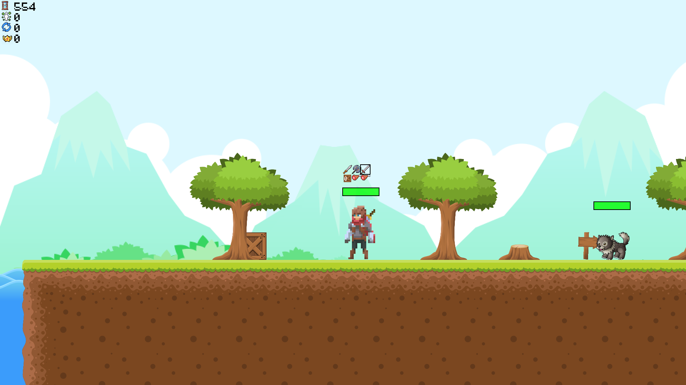

# The-Warden

Interactive Platformers combined with RPG's make an interesting combo, don't they? Maybe it works out...

## Controls
In-game the Character can be controlled by using the wasd-keys or enabling vision. What other keys are usable can be found in the settings menu; this is reachable from the main menu.
To select other items, one can use the scroll-wheel. It's also useful to note that blocks can only picked up when the block item is selected and can only be placed within a certain range of the Character.

## Installation
To run the game, one should be able to compile the sources. This can be done by using the makefile structure provided by HWLIB or creating your own. It's important to make sure sfml-audio, sfml-graphics, opencv and lpthread are used. How this should be done, can be found in the provided makefile.

OpenCV on Linux can be installed by running "sudo apt-get install libopencv-dev". How this should be done on Windows is unkown amongst us.
